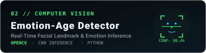
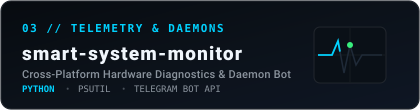
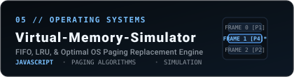
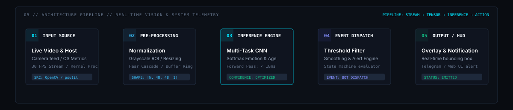
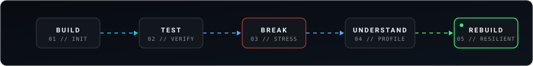
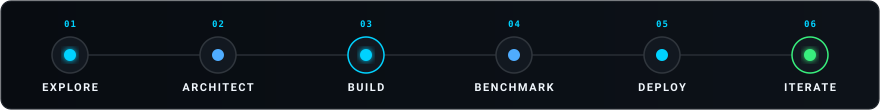

<div align="center">

<!-- HERO BANNER -->
<picture>
  <source media="(prefers-color-scheme: dark)" srcset="./dark.svg" />
  <source media="(prefers-color-scheme: light)" srcset="./light.svg" />
  
</picture>

<br/><br/>

<!-- ACTION / SOCIAL ANCHORS -->
<p align="center">
  <a href="https://github.com/Babul-Kumar">
    
  </a>
  &nbsp;
  <a href="https://www.linkedin.com/in/babul-kumar2007/">
    
  </a>
  &nbsp;
  <a href="mailto:babulkumar0220@gmail.com">
    
  </a>
</p>

</div>

---

### 01 // IDENTITY & THE STORY

```
WHO_I_AM:
├─ Name:         Babul Kumar
├─ Discipline:   Computer Science & Engineering
├─ Focus Areas:  Applied AI/ML • Computer Vision • System Daemons • Full-Stack
├─ Core Mindset: Build functional systems over chasing superficial hype
└─ Philosophy:   "Curiosity → Architecture → Code → Reliable Systems"
```

> *"Good software is quiet. It handles edge cases without complaint, scales predictably, and solves tangible problems."*

I'm a Computer Science & Engineering student focused on building practical software systems, real-time computer vision pipelines, and intelligent developer tooling.

My engineering journey centers around turning complex ideas into clean, functional code—from low-level system diagnostic daemons and memory simulation to applied machine learning models for natural language and image processing. I value lightweight architectures, predictable performance, and software designed with empathy for the person using it.

---

### 02 // ENGINEERING JOURNEY

<div align="center">
  
</div>

- **2024 · Foundations:** Core algorithms, data structures, and foundational systems programming; understanding OS memory allocation and basic computing architecture.
- **2025 · Applied ML & Systems:** Developing real-time computer vision engines (OpenCV, CNNs), hardware telemetry daemons (`smart-system-monitor`), and interactive paging algorithms (`Virtual-Memory-Simulator`).
- **2026 · Full-Stack & AI Tooling:** Building intelligent applications, inbox intelligence (`MailMind`), cryptographic image carriers (`Steganography-`), and developer productivity systems.

---

### 03 // CURRENTLY BUILDING

Active flagship engineering projects undergoing active architecture and feature iterations:

<table>
<tr>
<td width="50%" valign="top">

#### 🧠 [MailMind](https://github.com/Babul-Kumar/MailMind)
**AI Email Priority Scoring & Inbox Intelligence Engine**

- **Why It Exists:** Knowledge workers drown in cluttered inboxes because conventional email clients use naive chronological sorting rather than semantic importance.
- **How It Works:** Employs NLP preprocessing and deep learning classification to predict urgency, extract action items, and score message priority.
- **Engineering Status:** Actively refining vector embeddings and local inference latency for privacy-preserving email classification.

<br/>

👉 **[Inspect Repository →](https://github.com/Babul-Kumar/MailMind)**

</td>
<td width="50%" valign="top">

#### 👁️ [Emotion-age-detector](https://github.com/Babul-Kumar/Emotion-age-detector)
**Real-Time Computer Vision Facial Perception Pipeline**

- **Why It Exists:** Real-time facial analytics often suffer from jitter, slow frame processing, and excessive runtime overhead on consumer hardware.
- **How It Works:** Built on OpenCV and multi-task CNN architectures for simultaneous facial bounding, landmark extraction, age inference, and emotional expression classification.
- **Engineering Status:** Optimized frame-skipping and inference batching to sustain smooth 30+ FPS edge video analysis.

<br/>

👉 **[Inspect Repository →](https://github.com/Babul-Kumar/Emotion-age-detector)**

</td>
</tr>
</table>

---

### 04 // SELECTED PROJECTS & ARCHITECTURES

A curated index of public engineering repositories, system simulations, and research prototypes:

<table width="100%">
<tr>
<td width="50%" valign="top">

<a href="https://github.com/Babul-Kumar/MailMind">
  
</a>

**01 / MailMind**  
AI email priority classification and inbox intelligence engine powered by NLP deep learning pipelines.  
`Stack: Python • NLP • Deep Learning • Classification`  
🔗 **[View Repository](https://github.com/Babul-Kumar/MailMind)**

</td>
<td width="50%" valign="top">

<a href="https://github.com/Babul-Kumar/Emotion-age-detector">
  
</a>

**02 / Emotion-Age Detector**  
Real-time computer vision perception pipeline for facial emotion recognition and age estimation.  
`Stack: Python • OpenCV • CNN Inference • Computer Vision`  
🔗 **[View Repository](https://github.com/Babul-Kumar/Emotion-age-detector)**

</td>
</tr>
<tr>
<td width="50%" valign="top">

<a href="https://github.com/Babul-Kumar/smart-system-monitor">
  
</a>

**03 / smart-system-monitor**  
Lightweight cross-platform telemetry daemon and Telegram notification bot for CPU, RAM, and hardware diagnostics.  
`Stack: Python • psutil • Telegram Bot API • Daemons`  
🔗 **[View Repository](https://github.com/Babul-Kumar/smart-system-monitor)**

</td>
<td width="50%" valign="top">

<a href="https://github.com/Babul-Kumar/Steganography-">
  
</a>

**04 / Steganography-**  
Cryptographic Least Significant Bit (LSB) carrier tool encoding encrypted payloads inside lossless image canvas pixels.  
`Stack: TypeScript • Canvas API • Cryptography • Security`  
🔗 **[View Repository](https://github.com/Babul-Kumar/Steganography-)**

</td>
</tr>
<tr>
<td colspan="2" valign="top">

<a href="https://github.com/Babul-Kumar/Virtual-Memory-Simulator">
  
</a>

**05 / Virtual-Memory-Simulator**  
Interactive operating systems memory manager implementing FIFO, LRU, and Optimal paging replacement algorithms.  
`Stack: JavaScript • OS Architecture • Paging Algorithms`  
🔗 **[View Repository](https://github.com/Babul-Kumar/Virtual-Memory-Simulator)**

</td>
</tr>
</table>

---

### 05 // SYSTEMS & ARCHITECTURES

Real-time perceptual intelligence and background daemon telemetry architecture:

<div align="center">
  
</div>

```
PIPELINE INVARIANTS:
01 // RAW INPUT STREAM         Ingest video frames or system OS counters with zero blocking I/O.
02 // NORMALIZATION            Standardize color matrices, crop regions of interest, and parse raw bytes.
03 // INFERENCE ENGINE         Execute neural network forward-pass or diagnostic thresholding at edge speeds.
04 // EVENT DISPATCHER         Filter transient noise; route verified anomalies and state events to consumers.
05 // CLIENT HUD & TELEMETRY   Render live diagnostics or alert notification daemons with sub-50ms latency.
```

---

### 06 // TECHNICAL TOOLBOX & STACK

Grounded in practical, day-to-day engineering usage:

```
[LANGUAGES]
 Python                      JavaScript (ES6+)          TypeScript                 C / C++
 Java                        SQL                        Bash / Shell               PowerShell

[AI & PERCEPTION]
 Scikit-learn                OpenCV                     Convolutional Nets (CNN)   NLP Pipelines
 Deep Learning               Facial Landmark Detection  Feature Extraction         Calibration Metrics

[WEB & RUNTIME]
 React 18 / 19               Node.js                    Vite                       HTML5 / Canvas API
 FastAPI                     Express                    RESTful Protocols          Zustand / Hooks

[SYSTEMS & INFRASTRUCTURE]
 Git & GitHub Actions        Linux (Ubuntu / Debian)    psutil Telemetry           VS Code / Windows
 Process Daemons             Memory Paging Simulation   Least Significant Bit      Automation Scripts
```

<div align="center">
  
</div>

---

### 07 // DAILY DESK & WORKFLOW

```
WORKSPACE & HARDWARE:
├─ Workstation:  Windows Dev Workstation + Linux WSL2 environment for system scripts & daemons
├─ Editor:       VS Code (minimalist chrome, Error Lens, GitLens) + PowerShell & Bash
├─ Diagnostics:  Lightweight self-authored monitoring daemons for real-time memory & CPU tracking
└─ Mindset:      Write clean tests before optimizing; profile before assuming bottlenecks
```

<div align="center">
  
</div>

---

### 08 // GITHUB TELEMETRY & ACTIVITY FEED

<div align="center">
  
</div>

---

### 09 // CONTRIBUTION ACTIVITY

<div align="center">
  <p><b>52-WEEK ROLLING CONTRIBUTION HEATMAP</b></p>
  
</div>

---

### 10 // CONTRIBUTION SNAKE

<div align="center">
  <p><b>AUTOMATED CONTRIBUTION GRAPH SNAKE</b></p>

  <picture>
    <source media="(prefers-color-scheme: dark)" srcset="./assets/github-contribution-snake-dark.svg" />
    <source media="(prefers-color-scheme: light)" srcset="./assets/github-contribution-snake.svg" />
    
  </picture>
</div>

---

### 11 // LET'S TALK & COLLABORATE

Whether you want to discuss computer vision pipelines, background system daemons, machine learning systems, or collaborate on open-source software:

<div align="left">

- 💼 **LinkedIn:** [linkedin.com/in/babul-kumar2007](https://www.linkedin.com/in/babul-kumar2007/)
- ✉️ **Direct Email:** [babulkumar0220@gmail.com](mailto:babulkumar0220@gmail.com)
- 🐙 **GitHub:** [github.com/Babul-Kumar](https://github.com/Babul-Kumar)

</div>

<br/>

---

<div align="center">

```
BK // TURN IDEAS INTO RELIABLE SYSTEMS.
```
<sub>Engineered &amp; Maintained with care by **Babul Kumar** • Real projects &amp; verified code</sub>

</div>
